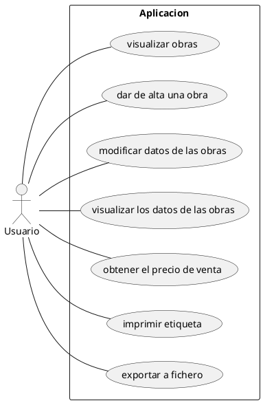

Nerea Muñoz Rebollo 1 DAM
~~
# PRÁCTICA OBLIGATORIA ENTORNOS

## Análisis del problema

### Requisitos Funcionales

1. Visualizar las obras de arte existentes 
2. Dar de alta una obra
3. Modificar los datos de las obras
4. Visualizar los datos de las obras
5. Obtener el precio de venta de las obras expuestas
6. Imprimir etiqueta
7. Exportar a fichero

### Requisitos no funcionales

1. Formato al exportar
2. Formato de la información del fichero
3. Unidad del precio (€)
4. Calculo del precio --> Calculos para hallar el precio
5. Unidad de la altura (m)
6. Unidad del peso (t)
7. Formato de impresión de la etiqueta*

### Casos de Uso

